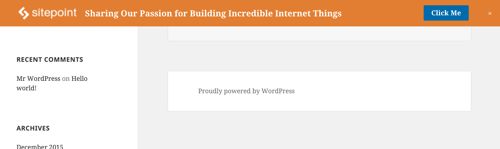

# sp-random-hello-bar
A hello bar is a thin bar of content that slides into view once the user scrolls past a set point on a page.
The message content is up to you, but is ideal for advertising, product annoncements or other messages.
This repo contains a WordPress plugin and npm module to randomly (with weighting) show a hello bar on page scroll.

- [WordPress plugin](#wordpress-plugin)
- [npm module](#npm-module)



## WordPress plugin
[sp-random-hello-bar](https://wordpress.org/plugins/sp-random-hello-bar/)
The plugin provides an admin interface to create multiple hello bar messages that can then be randomly displayed on user facing pages.

By setting weightings for each message you can determine how often each is displayed. On each page load a message is randomly selected
(respecting the weightings given). A random number is generated client side before fetching the message content to ensure it is compatible
with caching services such as W3 Total Cache.

All the required javascript and css is included in the plugin and can be set to enqueue via settings.
Alternatively you can roll your own.

### Installation

1. Upload the entire `/sp-random-hello-bar/` folder to the `/wp-content/plugins/` directory.
1. Activate the plugin through the 'Plugins' menu in WordPress.
1. Navigate to the **SP Random Hello Bar** section of the *Settings* menu. At `example.com` this page would be found at `http://example.com/wp-admin/options-general.php?page=sp-random-hello-bar`.
1. Enable the hello bar to display in pages.
1. Select which javascript, if any, you would like to enqueue.
1. Select if you would like to enqueue basic css styles fror the hello bar.
1. Enter content for one or more hello bars and set a weighting.

## npm module
The javascript that displays the hello bar as been extracted into a npm module so it can be used without the wordpress plugin.

[](https://github.com/sitepoint/sp-random-hello-bar)

### Install
```sh
npm install sp-hello-bar
```

You will also need a throttle function such as those provided by [lodash](https://lodash.com/docs#throttle) or [Underscore.js](http://underscorejs.org/#throttle)

### Basic Usage
given the following html
```html
<div class="SpHelloBar" style="background:#038D98;">
  <a class="SpHelloBar_container" target="_blank" href="http://www.sitepoint.com/">
    
    <span class="SpHelloBar_message" style="color:#fff;">Sharing Our Passion for Building Incredible Internet Things</span>
    <span class="SpHelloBar_action" style="background:#78cbd1;">Click Me</span>
  </a>
  <span class="SpHelloBar_close">x</span>
</div>
```
```js
import SpHelloBar from "sp-hello-bar"
import throttle   from "lodash/function/throttle";

const sph = new SpHelloBar({throttle});
sph.init();
```

### API

#### Constructor
The sp-hello-bar constructor takes a single options object as an argument. The supported options are:
* `isEnabled` (bool) should the hello bar initialise. Defaults to `true`.
* `isShown` (bool) is the hello bar visible. Defaults to `false`.
* `targetOffset` (int) the pageYOffset below which the hello bar will be shown. Defaults to `300`.
* `throttle` (function) the throttle function to be used on resize and scroll events. There is no default.
* `throttleWait` (int) the number of milliseconds to the throttle function will wait. Defaults to `500`.
* `elSelector` (string) the querySelector used to locate the hello bar dom element. Defaults to `.SpHelloBar`.
* `closeBtnSelector` (string) the querySelector used to locate the hello bar close button element. Defaults to `.SpHelloBar_close`.
* `linkSelector` (string) the querySelector used to locate the hello bar link element. Defaults to `.SpHelloBar_container`.
* `showClassName` (string) the className set on the hello bar dom element when visible. Defaults to `SpHelloBar u-show`.
* `hideClassName` (string) the className set on the hello bar dom element when hidden. Defaults to `SpHelloBar`.
The sp-hello-bar will try to initialise as long as it can match an element to `elSelector` so you could use simpler html without elements matching `closeBtnSelector` or `linkSelector` if they are not needed.

#### after()
To make the hello bar easy to extend an after hook is provided that allows you to register functions to be called after the various sp-hello-bar lifecycle methods.
```js
const sph = new SpHelloBar({throttle});

// extend SpHelloBar
sph.after('onClose', function() {
  console.log('The hello bar has been closed by the user.'));
});


sph.init();
```

The available lifecycle methods are:
* `beforeInit` generally used to set `isEnabled` to false if certain criteria are not met.
* `onInit` called when sp-hello-bar has been initialized.
* `onScroll` called on page scroll and resize.
* `onToggle` called when visibility of hello bar is changed.
* `onClick` called when the `linkSelector` element is clicked.
* `onClose` called when the `closeBtnSelector` element is clicked.

eg. Set cookie when hello bar is manually closed and dont initialise if cookie is already set
```js
function checkForCookie(){
  const hasCookie = ... // return true if cookie has been set
  if (hasCookie) this.isEnabled = false;
}
function setHelloBarCookie() { ... } // set a cookie

const sph = new SpHelloBar({throttle});

// extend SpHelloBar
sph.after('beforeInit', function() {
  checkForCookie.call(sph);
});
sph.after('onClose', function() {
  setHelloBarCookie();
});


sph.init();
```


